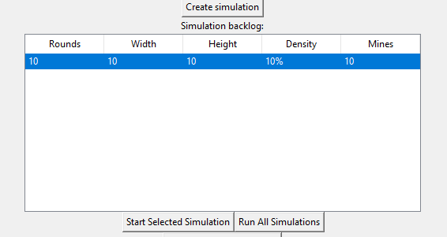
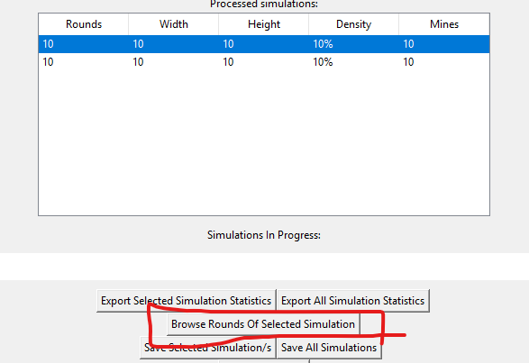
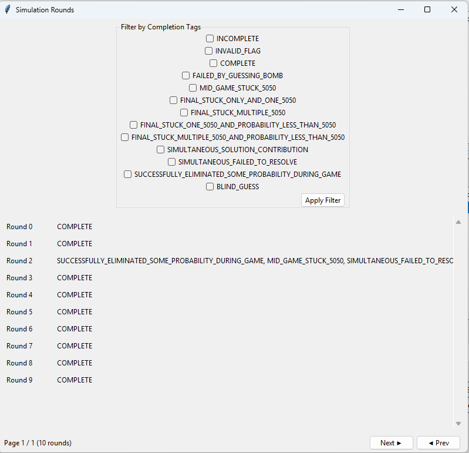

# Jordans task!
## How to run

  If you don't have python installed, please download it from:
  >https://www.python.org/downloads/

  *The newest version should do.*  
    
  Then open Terminal or Command Prompt, and enter the following to install libraries needed by the project.

  ### For mac
  >pip3 install numpy matplotlib tqdm sympy pygame

  ### For windows
  >pip install numpy matplotlib tqdm sympy pygame

  *if this doesn't work, it is likely that you need to install pip (however it is typically installed alongside python). You can find how to do this online via a search like "how to install pip for python on [mac or windows]"*

  Then simply open "jordanfile.py" using python (you may have to open with the python IDE and then run it by clicking the "Run" section on the menu bar, and then clicking "Run Module", also works by the keybind F5)

## Using the program

  The UI should be relatively intuitive.  
  
  You can select elements inside of the tables and then use the corresponding "X selected Y" (Ie "Start Selected Simulation" like in the image below.)  
  You can also select multiple elements and use *most* "X selected Y" buttons on the multiple selected elements.

  

  ### Simulation Statistics

  *A "completion tag" is something that rounds are given when they finish a certain way, there are various different tags that all describe different ways of the round completing.*

  The program can export the statistics of the sum of completion tags to a CSV file. It can also export multiple different simulations into one file, where each simulation has its own row. The simulation metadata (like rounds, size, mine density) consumes the first few columns of each entry.  
  The CSV files do have a header row.  

  ### Saving simulations and viewing their rounds.

  #### Viewing rounds
  You can view how the solver progressed through a round via selecting a processed simulation (from the bottom table) and then pressing the "Browse Rounds Of Selected Simulation" button.

  

  This will bring up a window where you can see what completion tags each round has and also filter by completion tags.

  

  The filter will show rounds that INCLUDE the checked completion tags. Rounds with checked tags AND others will also be shown.  

  You may have to extend the window to the right to see, but each round has a button called view/step. This will open a viewer of the board, which has a header, describing what the solver is doing in that step, and a yellow cell, to indicate the cell that was changed in that step.  
  Step this viewer forwards with the space key, and back with backspace.

  #### Saving Simulations

  Similarly to exporting statistics, you can select elements in the "Processed Simulations" table to save to file. The file that this saves can then be loaded back into the program using the "Load Simulations" button, it will be loaded back into the "Processed simulations" table and be available for viewing or exporting to statistics (or even saving again!).  

  *The save file is a binary format to minimise file size, so you should not expect to view the file itself*

## Completion tags and their meanings

